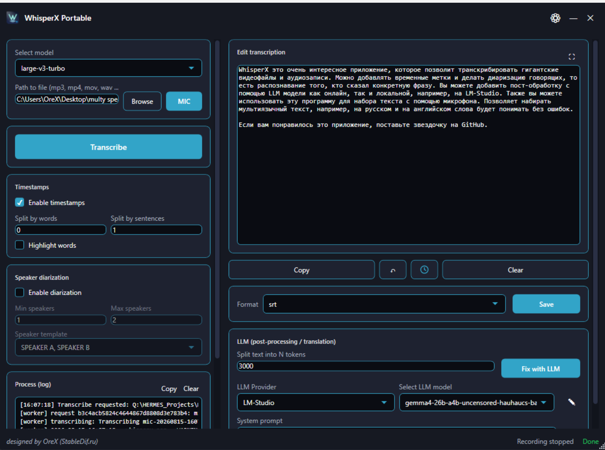

<p align="center">
  <a href="#english"><strong>English</strong></a> · <a href="#russian"><strong>Русский</strong></a>
</p>

<a id="english"></a>

<div align="center">

# 🎙️ WhisperX Portable

### Portable Windows transcription, microphone recording, subtitles, speaker diarization, and LLM post-processing

**Python, WhisperX, FFmpeg, and the application runtime are included in the portable build.**



</div>

---

## About

**WhisperX Portable** is a modern Windows desktop application built around [WhisperX](https://github.com/m-bain/whisperX). It transcribes audio and video files, records speech from a microphone, creates subtitles with accurate timestamps, identifies speakers, and can post-process or translate the resulting text through an OpenAI-compatible LLM provider.

The portable edition includes a self-contained .NET 8 WPF interface, bundled Python environment, FFmpeg, WhisperX, and the required dependencies. Models are downloaded into the relative `models/` directory next to the application, so the extracted folder can be moved to another Windows computer together with its downloaded models.

> [!IMPORTANT]
> The first transcription with a newly selected model requires an internet connection. Wait until the model has been completely downloaded into `models/` before moving the application to an offline computer.

## Features

- 🎧 transcribe common audio and video formats, including MP3, WAV, M4A, MP4, MOV, MKV, and more;
- 🎙️ record and transcribe speech directly from a selected microphone;
- ⚡ NVIDIA CUDA and CPU processing modes;
- 🧠 Whisper model selection from `tiny` to `large-v3` and `large-v3-turbo`;
- 📍 word-level alignment and accurate timestamps for file transcription;
- 📝 split subtitles by words or sentences;
- 🎤 optional speaker diarization with minimum/maximum speaker limits and selectable speaker labels;
- ✨ karaoke-style word highlighting for supported subtitle output;
- 💾 export to `SRT`, `VTT`, `TXT`, `TSV`, or `JSON`;
- 🖊️ built-in editor with copy, clear, undo/history, timestamp visibility, and fullscreen mode;
- 🤖 LLM post-processing and translation through configurable OpenAI-compatible providers;
- 🧩 reusable LLM providers, selectable models, system prompts, and long-text chunking;
- ⌨️ global microphone hotkey and reliable paste into the previously active application;
- 📌 tray mode, Windows startup option, start minimized, and single-instance behavior;
- 🚀 optional persistent worker keeps the ASR model loaded between transcriptions;
- 📦 Python, WhisperX, FFmpeg, and dependencies remain inside the application folder;
- 🗃️ all model caches are pinned to the relative `models/` directory;
- 🌐 interface available in 10 languages;
- 🎨 10 built-in themes: Dark, Light, Nord, Solarized, Dracula, Monokai, One Dark, Catppuccin Mocha, Tokyo Night, and Gruvbox.

## Quick Start

### Portable build — recommended

You do not need to install Python, .NET, FFmpeg, CUDA Toolkit, or additional packages. Everything required by the application is included in the portable archive.

<h2 align="center">
  <a href="https://github.com/orex2121/WhisperX-Portable/releases/latest">⬇️ DOWNLOAD PORTABLE</a>
</h2>

1. Download the latest portable archive using the link above.
2. Fully extract the archive to a folder with enough free disk space.
3. Run `WhisperX4.exe`.
4. Select a model and an audio/video file, then click **Transcribe**.
5. On first use, wait for the selected model to download into `models/`.

> [!IMPORTANT]
> Do not run the application directly from the archive. Extract the complete folder first. Do not move only `WhisperX4.exe` — the `runtime/`, `Backend/`, and configuration files are also required.

## Basic Usage

### Transcribe a file

1. Select a Whisper model.
2. Choose an audio or video file with **Browse**.
3. Configure timestamps, splitting, highlighting, and optional diarization.
4. Click **Transcribe**.
5. Review or edit the result.
6. Select an output format and click **Save**.

### Record from a microphone

1. Select the microphone in **Settings**.
2. Click **Mic** or use the configured global hotkey.
3. Speak and stop the recording.
4. The recognized text is appended to the editor.
5. Optionally enable automatic LLM processing after microphone transcription.

Microphone transcription intentionally produces clean text without speaker diarization or subtitle timestamps.

### Fix or translate text with an LLM

1. Open the LLM provider editor and add an OpenAI-compatible endpoint.
2. Test the connection and select a model.
3. Create or select a system prompt, for example proofreading or translation.
4. Set **Split text into N tokens** when processing long documents.
5. Click **Fix with LLM**.

The application supports local services such as **LM Studio** and **Ollama**, as well as compatible remote APIs. Provider compatibility may vary; use the exact base URL required by the service.

## Portable Model Storage

All machine-learning caches are redirected under the application folder:

```text
WhisperX-Portable/
└── models/
    ├── faster-whisper/        # Whisper / CTranslate2 model snapshots
    ├── huggingface/           # Hugging Face Hub and alignment models
    ├── sentence-transformers/ # auxiliary model cache
    ├── torch/                 # PyTorch cache
    └── torch-inductor/        # compiled PyTorch cache
```

This prevents models from silently being stored in `%USERPROFILE%\.cache` or another global Hugging Face cache. To move the application to another computer without downloading models again, copy the **entire extracted application folder**, including `models/`.

## Speaker Diarization

Diarization identifies who spoke and assigns speaker labels to file transcriptions. It uses gated models from Hugging Face.

1. Create a [Hugging Face account](https://huggingface.co/join).
2. Open [pyannote/speaker-diarization-community-1](https://huggingface.co/pyannote/speaker-diarization-community-1) and accept its access conditions.
3. Create a [read token](https://huggingface.co/settings/tokens).
4. Open **Settings** in WhisperX Portable and paste the token into the protected Hugging Face token field.
5. Enable **Speaker diarization** for a file transcription.

> [!NOTE]
> Diarization is intended for audio/video files. It is disabled for microphone transcription.

## Supported Languages

English is selected by default. The interface is available in:

`English` · `Русский` · `Deutsch` · `Español` · `Français` · `Italiano` · `日本語` · `한국어` · `Português` · `中文`

Whisper language detection also supports automatic detection and many additional transcription languages.

## System Requirements

| Component        | Requirement / recommendation                                                |
| ---------------- | --------------------------------------------------------------------------- |
| Operating system | Windows 10 or Windows 11, 64-bit                                            |
| Memory           | 8 GB minimum; 16 GB or more recommended for larger models                   |
| GPU              | Optional NVIDIA GPU; recent driver recommended for CUDA processing          |
| CPU mode         | Available, but substantially slower for large models                        |
| Disk             | Enough space for the portable runtime plus selected models and output files |
| Internet         | Required for first-time model downloads and remote LLM providers            |

If GPU memory is limited, select a smaller model, use `int8`, reduce the batch size, or switch to CPU mode.

## Portable Folder Structure

```text
WhisperX-Portable/
├── WhisperX4.exe             # main WPF application
├── WhisperX.bat              # optional environment-aware launcher
├── Backend/
│   └── whisperx_worker.py    # persistent WhisperX worker
├── runtime/
│   ├── python/               # portable Python
│   ├── venv/                 # WhisperX and Python dependencies
│   └── ffmpeg/               # bundled FFmpeg
├── models/                   # portable model caches
├── output/                   # exported transcription files
├── rec/                      # microphone recordings
├── Themes/                   # generated themes
├── config.json               # application settings
├── config_themes.json        # theme definitions
├── llm_providers.json        # LLM provider profiles
├── system_prompts.json       # reusable system prompts
├── LICENSE
└── README.md
```

## Troubleshooting

### The model is downloading again

Make sure you copied the complete `models/` directory and launched the executable from the same extracted application folder. Check that the expected model exists under `models/faster-whisper/` or `models/huggingface/`.

### Out of memory

Choose a smaller Whisper model, switch the compute type to `int8`, reduce the batch size, close other GPU applications, or select CPU processing.

### Diarization does not start

Verify that the Hugging Face token is valid and that the access conditions for the gated pyannote model were accepted under the same account.

### An LLM provider does not connect

Confirm the base URL, API key, and model name. Some services use `/v1`, while others use `/api/v1`. Test the provider before selecting it on the main screen.

## Limitations

- transcription quality depends on the source audio, language, model, and processing settings;
- large models require more disk space, memory, and GPU memory;
- CPU processing may be slow;
- speaker diarization is probabilistic and may confuse speakers with similar voices;
- remote LLM processing sends selected text to the configured external provider;
- API keys and the Hugging Face token are stored in local configuration files, so do not publish your personal configured copies;
- third-party model and API availability can change independently of this application.

## Credits

- [WhisperX](https://github.com/m-bain/whisperX) by Max Bain — transcription, alignment, and diarization pipeline;
- 
- [pyannote-audio](https://github.com/pyannote/pyannote-audio) — voice activity detection and speaker diarization;
- [NAudio](https://github.com/naudio/NAudio) — microphone capture on Windows;
- [FFmpeg](https://ffmpeg.org/) — media decoding and conversion;
- [python-build-standalone](https://github.com/astral-sh/python-build-standalone) — portable CPython runtime.

## License

This project is distributed under the [BSD 2-Clause License](LICENSE). Bundled and downloaded third-party components retain their own licenses.

---

Buy the developers a coffee: ☕ ☕ ☕

Let us know if you encounter a problem and we will do our best to fix it. You can support the project here: 
[❤️❤️❤️ D O N A T ❤️❤️❤️](https://boosty.to/stabledif)

**by StableDif & OreX**

<a id="russian"></a>

---

<div align="center">

## Русская версия

# 🎙️ WhisperX Portable

### Портативная транскрибация для Windows, запись с микрофона, субтитры, диаризация и LLM-обработка

**Python, WhisperX, FFmpeg и среда приложения уже включены в portable-сборку.**


</div>

---

## О проекте

**WhisperX Portable** — современное Windows-приложение на базе [WhisperX](https://github.com/m-bain/whisperX). Оно транскрибирует аудио- и видеофайлы, записывает речь с микрофона, создаёт субтитры с точными таймстампами, определяет говорящих и может исправлять или переводить полученный текст через OpenAI-совместимый LLM-провайдер.

Portable-версия включает self-contained интерфейс .NET 8 WPF, встроенный Python, FFmpeg, WhisperX и необходимые зависимости. Модели скачиваются в относительную папку `models/` рядом с приложением, поэтому распакованную папку можно переносить на другой Windows-компьютер вместе с уже загруженными моделями.

> [!IMPORTANT]
> Для первой транскрибации новой моделью требуется интернет. Перед переносом приложения на офлайн-компьютер дождитесь полной загрузки модели в `models/`.

## Возможности

- 🎧 транскрибация популярных аудио- и видеоформатов: MP3, WAV, M4A, MP4, MOV, MKV и других;
- 🎙️ запись и транскрибация речи непосредственно с выбранного микрофона;
- ⚡ режимы обработки NVIDIA CUDA и CPU;
- 🧠 выбор Whisper-моделей от `tiny` до `large-v3` и `large-v3-turbo`;
- 📍 пословное выравнивание и точные таймстампы для файловой транскрибации;
- 📝 разбиение субтитров по словам или предложениям;
- 🎤 опциональная диаризация с минимальным/максимальным числом говорящих и выбором шаблона меток;
- ✨ karaoke-подсветка текущего слова для поддерживаемого формата субтитров;
- 💾 экспорт в `SRT`, `VTT`, `TXT`, `TSV` или `JSON`;
- 🖊️ встроенный редактор с копированием, очисткой, отменой/историей, скрытием таймстампов и полноэкранным режимом;
- 🤖 LLM-исправление и перевод через настраиваемые OpenAI-совместимые провайдеры;
- 🧩 профили LLM-провайдеров, выбор моделей, системные промпты и разбиение длинного текста на чанки;
- ⌨️ глобальный хоткей микрофона и надёжная вставка текста в ранее активное приложение;
- 📌 сворачивание в трей, запуск вместе с Windows, старт в свёрнутом виде и защита от запуска второй копии;
- 🚀 опциональный persistent worker удерживает ASR-модель в памяти между транскрибациями;
- 📦 Python, WhisperX, FFmpeg и зависимости остаются внутри папки приложения;
- 🗃️ все кеши моделей закреплены за относительной папкой `models/`;
- 🌐 интерфейс на 10 языках;
- 🎨 10 встроенных тем: Dark, Light, Nord, Solarized, Dracula, Monokai, One Dark, Catppuccin Mocha, Tokyo Night и Gruvbox.

## Быстрый запуск

### Portable-сборка — рекомендуется

Устанавливать Python, .NET, FFmpeg, CUDA Toolkit или дополнительные пакеты не нужно. Всё необходимое уже находится в portable-архиве.

<h2 align="center">
  <a href="https://github.com/orex2121/WhisperX-Portable/releases/latest">⬇️ DOWNLOAD PORTABLE</a>
</h2>

1. Скачайте актуальный portable-архив по ссылке выше.
2. Полностью распакуйте архив в папку с достаточным количеством свободного места.
3. Запустите `WhisperX4.exe`.
4. Выберите модель и аудио- или видеофайл, затем нажмите **Transcribe**.
5. При первом запуске дождитесь загрузки выбранной модели в `models/`.

> [!IMPORTANT]
> Не запускайте приложение непосредственно из архива — сначала полностью распакуйте папку. Не переносите только `WhisperX4.exe`: для работы также нужны `runtime/`, `Backend/` и файлы конфигурации.

## Основное использование

### Транскрибация файла

1. Выберите Whisper-модель.
2. Укажите аудио- или видеофайл кнопкой **Browse**.
3. Настройте таймстампы, разбиение, подсветку и при необходимости диаризацию.
4. Нажмите **Transcribe**.
5. Проверьте или отредактируйте результат.
6. Выберите формат и нажмите **Save**.

### Запись с микрофона

1. Выберите микрофон в **Settings**.
2. Нажмите **Mic** или используйте настроенный глобальный хоткей.
3. Произнесите текст и остановите запись.
4. Распознанный текст будет добавлен в редактор.
5. При необходимости включите автоматическую LLM-обработку после микрофонной транскрибации.

Микрофонная транскрибация намеренно возвращает чистый текст без диаризации и таймстампов субтитров.

### Исправление или перевод через LLM

1. Откройте редактор LLM-провайдеров и добавьте OpenAI-совместимый endpoint.
2. Проверьте соединение и выберите модель.
3. Создайте или выберите системный промпт, например для исправления текста или перевода.
4. Для длинных документов задайте **Split text into N tokens**.
5. Нажмите **Fix with LLM**.

Поддерживаются локальные сервисы **LM Studio** и **Ollama**, а также совместимые удалённые API. Совместимость зависит от провайдера — используйте точный Base URL из его документации.

## Портативное хранение моделей

Все кеши машинного обучения перенаправлены внутрь папки приложения:

```text
WhisperX-Portable/
└── models/
    ├── faster-whisper/        # модели Whisper / CTranslate2
    ├── huggingface/           # Hugging Face Hub и alignment-модели
    ├── sentence-transformers/ # вспомогательный кеш моделей
    ├── torch/                 # кеш PyTorch
    └── torch-inductor/        # скомпилированный кеш PyTorch
```

Это предотвращает незаметную загрузку моделей в `%USERPROFILE%\.cache` или другой глобальный кеш Hugging Face. Чтобы перенести приложение на другой компьютер без повторной загрузки моделей, копируйте **всю распакованную папку приложения**, включая `models/`.

## Диаризация говорящих

Диаризация определяет, кто говорил, и добавляет метки говорящих в файловую транскрибацию. Для неё используются gated-модели Hugging Face.

1. Создайте [аккаунт Hugging Face](https://huggingface.co/join).
2. Откройте [pyannote/speaker-diarization-community-1](https://huggingface.co/pyannote/speaker-diarization-community-1) и примите условия доступа.
3. Создайте [read-токен](https://huggingface.co/settings/tokens).
4. Откройте **Settings** в WhisperX Portable и вставьте токен в защищённое поле Hugging Face token.
5. Включите **Speaker diarization** перед транскрибацией файла.

> [!NOTE]
> Диаризация предназначена для аудио- и видеофайлов. Для микрофонной транскрибации она отключена.

## Поддерживаемые языки

По умолчанию используется English. Языки интерфейса:

`English` · `Русский` · `Deutsch` · `Español` · `Français` · `Italiano` · `日本語` · `한국어` · `Português` · `中文`

Автоопределение Whisper поддерживает значительно больше языков транскрибации.

## Системные требования

| Компонент            | Требование / рекомендация                                      |
| -------------------- | -------------------------------------------------------------- |
| Операционная система | Windows 10 или Windows 11, 64-bit                              |
| ОЗУ                  | минимум 8 ГБ; для крупных моделей рекомендуется 16 ГБ и больше |
| GPU                  | опциональная NVIDIA; для CUDA рекомендуется актуальный драйвер |
| CPU-режим            | доступен, но крупные модели работают значительно медленнее     |
| Диск                 | место для portable-среды, выбранных моделей и выходных файлов  |
| Интернет             | нужен для первой загрузки моделей и удалённых LLM-провайдеров  |

При нехватке видеопамяти выберите модель поменьше, установите `int8`, уменьшите batch size или переключитесь на CPU.

## Структура portable-папки

```text
WhisperX-Portable/
├── WhisperX4.exe             # основное WPF-приложение
├── WhisperX.bat              # опциональный launcher с настройкой окружения
├── Backend/
│   └── whisperx_worker.py    # persistent worker WhisperX
├── runtime/
│   ├── python/               # портативный Python
│   ├── venv/                 # WhisperX и Python-зависимости
│   └── ffmpeg/               # встроенный FFmpeg
├── models/                   # портативные кеши моделей
├── output/                   # экспортированные транскрибации
├── rec/                      # записи с микрофона
├── Themes/                   # сгенерированные темы
├── config.json               # настройки приложения
├── config_themes.json        # описания тем
├── llm_providers.json        # профили LLM-провайдеров
├── system_prompts.json       # системные промпты
├── LICENSE
└── README.md
```

## Решение проблем

### Модель загружается повторно

Убедитесь, что вы скопировали всю папку `models/` и запускаете exe из той же распакованной папки приложения. Проверьте наличие нужной модели в `models/faster-whisper/` или `models/huggingface/`.

### Не хватает памяти

Выберите Whisper-модель поменьше, переключите compute type на `int8`, уменьшите batch size, закройте другие GPU-приложения или используйте CPU.

### Не запускается диаризация

Проверьте токен Hugging Face и убедитесь, что условия доступа к gated-модели pyannote приняты в том же аккаунте.

### Не подключается LLM-провайдер

Проверьте Base URL, API-ключ и имя модели. Некоторые сервисы используют `/v1`, другие — `/api/v1`. Перед выбором провайдера на главном экране выполните его проверку.

## Ограничения

- качество транскрибации зависит от исходного звука, языка, модели и настроек;
- крупные модели требуют больше места, оперативной и видеопамяти;
- CPU-обработка может быть медленной;
- диаризация вероятностная и иногда путает похожие голоса;
- удалённая LLM-обработка отправляет выбранный текст настроенному внешнему провайдеру;
- API-ключи и токен Hugging Face сохраняются в локальных конфигурационных файлах — не публикуйте свои персонально настроенные копии;
- доступность сторонних моделей и API может меняться независимо от приложения.

## Благодарности

- [WhisperX](https://github.com/m-bain/whisperX) от Max Bain — транскрибация, выравнивание и диаризация;
- [pyannote-audio](https://github.com/pyannote/pyannote-audio) — определение речи и диаризация;
- [NAudio](https://github.com/naudio/NAudio) — запись с микрофона в Windows;
- [FFmpeg](https://ffmpeg.org/) — декодирование и конвертация медиа;
- [python-build-standalone](https://github.com/astral-sh/python-build-standalone) — портативный CPython.

## Лицензия

Проект распространяется по [BSD 2-Clause License](LICENSE). Встроенные и загружаемые сторонние компоненты сохраняют собственные лицензии.

---

Купить кофе разработчикам: ☕ ☕ ☕

Сообщите о проблеме, и мы постараемся её исправить. Поддержать проект можно здесь: 
[❤️❤️❤️ D O N A T ❤️❤️❤️](https://boosty.to/stabledif)

**by StableDif & OreX**
